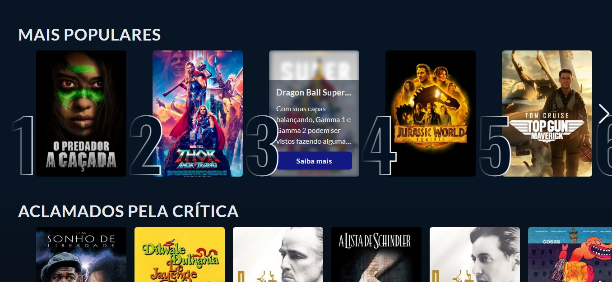

# TOP MOVIES

## 🛠 EM PRODUÇÃO 🛠

## Tela inicial
Essa lista pode mudar dependendo dos filmes que estão no TOP do momento que você esta vendo

## Mais informações sobre o filme que te interessou

## Exemplo de filtro
para filtrar, basta clica em um dos gêneros do filme que mais te interessou

## Tecnologias usadas
  - React
  - React-router-dom
  - Typescript
  - Tailwind
  - Swiper
  - Material UI

## Métodos usados
  - Context API 
  - Fetch API 
  - React Hooks
  - Herança
  - Polimorfismo
  - Props
  - Navegação com o react-router-dom
  - Componentização
  - Arrisco dizer um Clean Code
  - Separação de dependências
  - Variável Ambiente